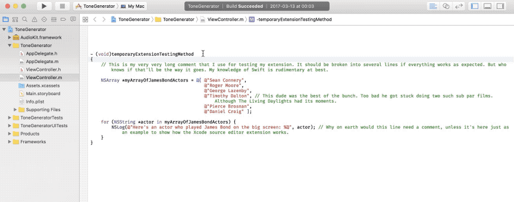

# Comment Boss
Comment Boss is an Xcode Source Editor extension which lets you quickly reformat long comments to multiple lines.

### To build

* Select menu item Product > Archive.
* In the Organizer window's Archives tab, select Export.
* Choose Export as Developer-ID signed Application.

### Installation
* Copy the Comment Boss application to your Applications folder, or some other location on your drive.
* Launch the Comment Boss application.
* Open System Preferences and enable Comment Boss in the Extensions section.

The Comment Boss extension should now appear at the bottom of Xcode’s Editor menu.

### Usage
In Xcode, place the cursor on a line containing a long code comment and invoke the Comment Boss > Reformat Comment to Multiple Lines extension from the Editor menu.

### Developed based on information from

##### Using and Extending the Xcode Source Editor – WWDC'2016 session 414
https://developer.apple.com/videos/play/wwdc2016/414/

##### Extending Xcode 8 – Daniel Jalkut – 2016-10-08
https://news.realm.io/news/jalkut-extending-xcode-8/

"You could take text in a document and send it to a webservice for automatic translation"

"Maybe open a browser window based on the selected text"

"Configuration and preferences should live in the App"

Steps to get started:

1. Create a new Mac application
2. Add a new extension target and accept Xcode's suggestion to Activate the scheme
3. Build & run the extension
4. Select Xcode as the target to debug in
(Debugging often fails the first time, try again and it will work)

You must sign your app and extension or it won't show up!

Tips:

In the Scheme Editor (for the extension, not the app), under Run/Debug, change Executable from "Ask on Launch" to "Xcode".

Pass a source file as argument to have Xcode automatically launch with a file to test. In the Arguments tab in the scheme editor, add a path to a file in the Arguments Passed On Launch field.

Give your command a Keyboard Shortcut, from Xcode's preferences > Key Bindings.
